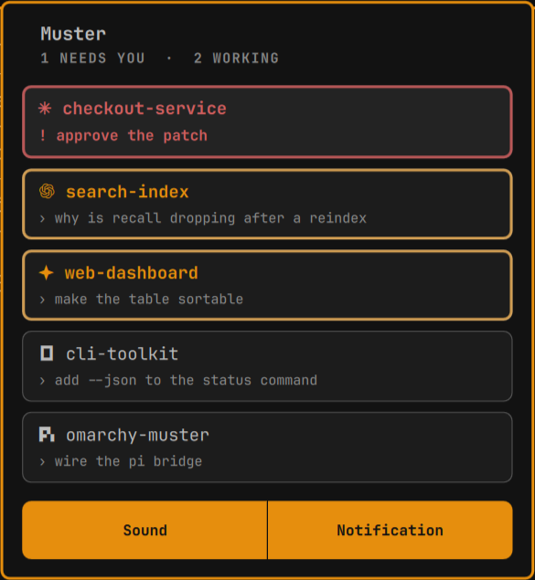

# Muster

**English** · [中文](README.zh.md)

Live coding-agent sessions in the Omarchy bar, with a completion sound and a
desktop notification — without running a terminal multiplexer.

- **Bar chip** — one mark per agent that has a session, in the order that needs
  attention (blocked first, then working). The marks are omarchy's own — the
  ones its menu shows for `omarchy default agent` — so they are brand glyphs
  rather than invented symbols. The window is deliberately short: past five
  marks it clips and scrolls, the way the media widget runs a long track title,
  so a busy bar never pushes the clock around. Always visible; a bell when
  nothing is running, because a chip that disappears is a chip you cannot click.
- **Panel** (click the chip) — one card per session: the agent's mark and the
  folder it is working in, then whatever the state has to say (the last prompt,
  or the message when it is blocked). No agent name on the card — the mark says
  who, the folder says where. The card interior is always the same grey; the
  state lives on the rim and in the title: a working card gets a soft
  theme-coloured rim that breathes, a blocked card the urgent colour, idle
  nothing. No elapsed timers: the panel answers "is anything running and does it
  need me".
- **Alerts** — when a run finishes, a sound and an Omarchy notification.
  Clicking the notification focuses that session's terminal. **Clicking a card**
  fires the same alert on demand for that session, with `test` in the
  notification title so it cannot be mistaken for a real completion.

## Screenshots

<!-- Drop your captures in assets/ and uncomment. The marketplace also picks up
     one optional preview.png in the repository root (JPEG/WebP/AVIF work too;
     it is optimized automatically, up to 50 MB / 40 megapixels). -->

<!--  -->

<!--  -->

## How it gets state

**Records only.** Agents write one small JSON file per session and the plugin
watches the directory. There is no window-title scraping, no process scanning,
no rule engine — nothing that can guess a state wrong or silently stop
working. The bundled pi bridge reports exact `working` / `blocked` / `idle`,
plus a `completedRuns` counter that makes "a run just finished" unmissable.

Adding an agent is therefore also exact: write records. See
*Adding another agent* below.

## Install

```bash
# 1. the shell plugin
omarchy plugin add https://github.com/77-223255/omarchy-muster.git --enable
omarchy plugin enable shienze.muster left     # placement, if you skipped --enable

# 2. the pi bridge
ln -sfn ~/.config/omarchy/plugins/shienze.muster/pi/muster.ts \
        ~/.pi/agent/extensions/muster.ts

# 3. verify every dependency it shells out to
~/.config/omarchy/plugins/shienze.muster/bin/muster-doctor
```

Restart pi for the bridge to load. Changing a `.qml` file hot-reloads the
widget, except the IPC target: after edits, `omarchy restart shell`.

### Working from a checkout

`omarchy plugin add` clones into `~/.config/omarchy/plugins/<id>/`. To keep
editing a checkout instead, point that path at the repo — the shell follows the
symlink, and the plugin id still comes from `manifest.json`:

```bash
git clone https://github.com/77-223255/omarchy-muster.git ~/Projects/omarchy-muster
ln -sfn ~/Projects/omarchy-muster ~/.config/omarchy/plugins/shienze.muster
omarchy-shell shell rescanPlugins
omarchy plugin enable shienze.muster left
```

## Removal

```bash
# 1. the pi bridge
rm -f ~/.pi/agent/extensions/muster.ts

# 2. the shell plugin (removes the bar entry and the plugin directory)
omarchy plugin disable shienze.muster
omarchy plugin remove shienze.muster

# 3. the session records it read
rm -rf "${XDG_STATE_HOME:-$HOME/.local/state}/omarchy/muster"
```

`omarchy plugin remove` deletes the plugin directory and its entry in
`~/.config/omarchy/shell.json`, and nothing else. If you installed from a
checkout with the symlink above, delete the symlink and your clone instead:

```bash
rm -f ~/.config/omarchy/plugins/shienze.muster
rm -rf ~/Projects/omarchy-muster
```

No file outside `~/.config/omarchy/`, `~/.local/state/omarchy/muster/` and the
pi bridge symlink is touched, and no user configuration is overwritten without
you doing it from the panel.

## Using it

| Where | Action |
|-------|--------|
| Bar chip | left click = panel, middle click = test alert |
| Panel card | click = fire a test alert for that session |
| Panel keys | `j`/`k` move, Enter fires the selected card's alert, `t` the first session's, Esc closes |
| IPC | `omarchy-shell shienze.muster <open\|close\|toggle\|test\|status>` |

```bash
omarchy-shell shienze.muster status | jq '.details[]'
# {"agent":"pi","state":"working","folder":"tiny-model-primitives",
#  "pid":835161,"completedRuns":3,"window":"0x601dc3f347b0"}
```

## Settings

Two toggles, in the panel and in `~/.config/omarchy/shell.json`:

| Key | Default | Meaning |
|-----|---------|---------|
| `soundEnabled` | `true` | Chime when a run finishes |
| `notifyEnabled` | `true` | Desktop notification when a run finishes |

Everything else is deliberately internal — a widget whose alerts went quiet
because of a stray setting is worse than one you tune by editing a line. They
live at the top of `Service.qml`:

| Constant | Value | Meaning |
|----------|-------|---------|
| `refreshIntervalSec` | `2` | Rescan cadence for new/removed records (existing records are watched, so alerts are immediate) |
| `staleAfterSec` | `120` | Forget a record whose writer stopped (the bridge heartbeats every 30s) |
| `debounceMs` | `2000` | Collapse several sessions finishing together into one alert |
| `soundFile` | freedesktop `complete.oga` | |
| `soundPlayer` | `paplay` | `pw-play` / `mpv` work too |

## The record contract

One JSON object per session in
`$XDG_STATE_HOME/omarchy/muster/sessions/` (default
`~/.local/state/...`). Any filename ending in `.json`. Write it atomically
(temp file + `rename`) and re-touch it as a heartbeat.

| Field | Notes |
|-------|-------|
| `schemaVersion` | `1` |
| `agent` | required; any id works, and omarchy's own aliases (`claude-code`, `oh-my-pi`, `cursor`, …) fold into their canonical agent |
| `sessionId`, `name`, `cwd`, `project` | identity and display; `project` defaults to the basename of `cwd` |
| `state` | `working` \| `blocked` \| `idle` \| `unknown` |
| `message` | shown when `blocked` |
| `lastPrompt` | shown on the card |
| `pid` | owning process; also how duplicate records are collapsed |
| `windowAddress` | Hyprland address; makes the notification's click focus that terminal |
| `updatedAt` | ms epoch; drives staleness (`staleAfterSec`) |
| `completedRuns` | **the alert trigger** — increment once per finished run |
| `seq` | monotonic writer counter, used to pick the freshest of two records for one pid |

The alert fires on a `completedRuns` **increase**, not on a state change, so a
short run that goes `working → idle` between two scans still chimes exactly
once.

## The agents omarchy ships

All thirteen agents `omarchy default agent` accepts are known by name, plus the
aliases that command takes: `claude-code`, `oh-my-pi`, `open-code`, `cursor`,
`github-copilot`, `gemini-cli`, `muse-code`, … A record written under an alias
folds into the canonical agent instead of becoming a second one.

The bar chip draws each agent with omarchy's own mark, taken from
`setup.default.agent.*` in
`/usr/share/omarchy/default/omarchy/omarchy-menu.jsonc`: eight are brand glyphs
in `/usr/share/fonts/omarchy/omarchy.ttf` (U+E901…U+E90D) and five are Nerd
Font glyphs, exactly as omarchy's own menu draws them.

| id | shown as | also accepts |
|----|----------|--------------|
| `pi` | Pi | `pi-coding-agent` |
| `omp` | Oh My Pi | `oh-my-pi` |
| `opencode` | OpenCode | `open-code` |
| `claude` | Claude | `claude-code`, `anthropic` |
| `codex` | Codex | `openai-codex` |
| `copilot` | Copilot | `github-copilot` |
| `crush` | Crush | |
| `cursor-agent` | Cursor | `cursor` |
| `gemini` | Gemini | `gemini-cli` |
| `grok` | Grok | |
| `hermes` | Hermes | |
| `muse` | Muse | `muse-code`, `musecode` |
| `openclaw` | OpenClaw | |

Anything else works too and is shown under its own id (no mark until one is
given). Adding an agent is one line in the `AGENTS` table at the top of
`Model.js`, carrying omarchy's own codepoint for it.

## Adding another agent

`bin/muster-report` is the writer for everything that is not pi:

```bash
report=~/.config/omarchy/plugins/shienze.muster/bin/muster-report

$report --agent claude --session "$SESSION_ID" --state working \
        --name "Refactor auth" --cwd "$PWD" --prompt "$PROMPT"
$report --agent claude --session "$SESSION_ID" --state blocked --message "approve"
$report --agent claude --session "$SESSION_ID" --state idle --completed  # chime + popup
$report --agent claude --session "$SESSION_ID" --remove
```

It resolves the terminal window from `--pid` (default `$PPID`) through the
Hyprland client list, so the notification's click focuses the right terminal
without extra plumbing. A Claude Code `Stop` hook is then one line:

```jsonc
// ~/.claude/settings.json
{ "hooks": { "Stop": [ { "hooks": [ { "type": "command",
  "command": "~/.config/omarchy/plugins/shienze.muster/bin/muster-report --agent claude --session \"$CLAUDE_SESSION_ID\" --state idle --completed" } ] } ] } }
```

### What omarchy does and does not provide

There is no unified agent-state hook to plug into. What exists is adjacent:

- `omarchy agent` launches the default agent and stamps every launched window
  with the class **`org.omarchy.agent`** (deliberately the same class for all of
  them, for window rules and themes). That is a reliable "this is an
  omarchy-launched agent window" signal, but it says nothing about which agent
  it is or whether it is working — and `--inline` skips it.
- `~/.config/omarchy/hooks/<event>.d/` are lifecycle hooks only:
  `battery-low`, `font-set`, `post-boot`, `post-update`, `pre-refresh-pacman`,
  `theme-set`. None of them fire on agent activity.
- `omarchy-agent-usage-<agent>` *is* a unified plugin interface, but for quota:
  one collector per agent, writing one JSON record that `omarchy.agents` reads.
  This plugin deliberately mirrors that shape for live state.

So state has to come from the agent itself: a hook where the agent has one
(Claude's `Stop`, Codex's `notify`, pi's extension API), or a wrapper where it
has not. Either way the sink is the same one-line call above.

## Dependencies

No build step, no package manager, no network access. The languages are the
hosts' contracts, not a choice: an omarchy bar widget/service must be QML, a pi
extension must be TypeScript.

| Piece | Language | Depends on |
|-------|----------|-----------|
| `Service.qml`, `BarWidget.qml`, `Panel.qml`, `Record.qml` | QML | omarchy shell (Quickshell, Qt 6), `hyprctl`, `find`, `mkdir` |
| `Model.js` | JavaScript (QML engine) | nothing |
| `pi/muster.ts` | TypeScript | pi's bundled Bun runtime; node builtins only, zero npm packages |
| `bin/muster-report` | Bash | `jq`, `flock`, `hyprctl` |
| alerts | — | `paplay` (or `pw-play`/`mpv`) and `omarchy-notification-send` |

`bin/muster-doctor` checks all of it (`--json` for machines) and exits
non-zero only when something required is missing.

Rust would not help here. It cannot be a Quickshell plugin or a pi extension,
so a compiled component could only be a separate daemon with a socket — which
is the heavy thing this plugin exists to avoid — or a replacement for a
`jq`+`flock` script on a machine that already ships both.

## Deliberately out of scope

Detecting agents that publish nothing (window-title scraping, process
sniffing). It was built, it worked, and it was ~700 extra lines plus a rule
engine, because a widget outside the terminal cannot see the pane contents —
and terminals that host several windows in one process (ghostty
single-instance, kitty) make `pid → window` ambiguous, so a title match alone
proves very little. The honest fix for a new agent is a hook. If automated
detection is ever wanted, the cheap version is gated on omarchy's own
`org.omarchy.agent` class rather than on process sniffing, and it belongs in
its own small plugin, not here.

## Files

| Path | Purpose |
|------|---------|
| `manifest.json` | plugin manifest (`service` + `bar-widget`) |
| `Service.qml` | singleton: watch records, sort sessions, fire alerts |
| `BarWidget.qml` | bar chip, settings push, IPC |
| `Panel.qml` | session panel and the two toggles |
| `Record.qml` | one watched session record |
| `Model.js` | record normalization, ordering, agent names and marks |
| `pi/muster.ts` | pi → record bridge |
| `bin/muster-report` | record writer for other agents |
| `bin/muster-doctor` | dependency check |
| `docs/marketplace-submission.md` | the exact text for a marketplace listing issue |

## Troubleshooting

```bash
omarchy-shell shienze.muster status | jq '.details[]'   # what the widget sees
~/.config/omarchy/plugins/shienze.muster/bin/muster-doctor   # dependencies
journalctl --user --since "5 min ago" -o cat SYSLOG_IDENTIFIER=omarchy-shell | grep -i muster
omarchy-shell shienze.muster test                        # prove the alert path
```

- **Chip stays dim**: no record is being written. Run an agent, or write one by
  hand with `muster-report`.
- **A session lingers after a crash**: it disappears `staleAfterSec` after the
  last heartbeat.
- **No sound**: `command -v paplay`, and check the *Completion sound* toggle.
- **IPC function missing after an edit**: `omarchy restart shell`.

## License

MIT — see [LICENSE](LICENSE).
