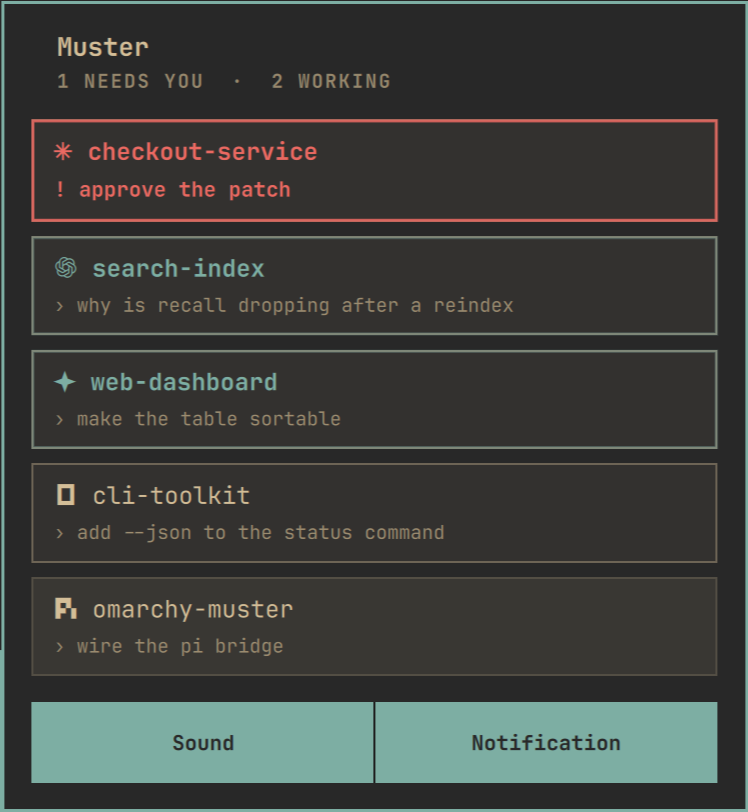
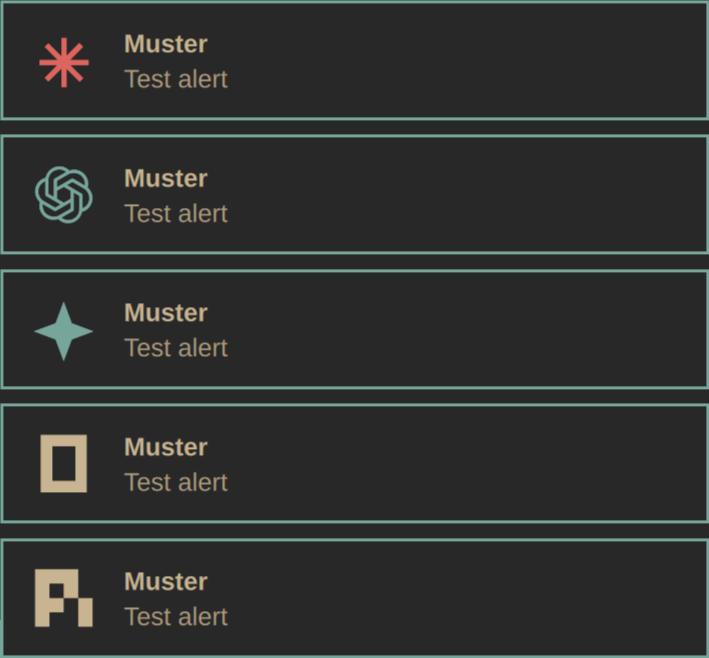

# Muster

**English** · [中文](README.zh.md)

Live coding-agent sessions in the Omarchy bar, with a completion sound and a
desktop notification — without running a terminal multiplexer.

- **Bar chip** — one mark per agent that has a session, in the order that needs
  attention (blocked first, then working). Each mark is coloured by its own
  session's state — the urgent colour when that agent is blocked, the theme
  accent while it runs, plain bar text when it is idle — so a mixed bar reads at
  a glance instead of turning one colour. The marks are omarchy's own — the
  ones its menu shows for `omarchy default agent` — so they are brand glyphs
  rather than invented symbols. The window is deliberately short: past five
  marks it clips and scrolls, the way the media widget runs a long track title,
  so a busy bar never pushes the clock around. Always visible; a bell when
  nothing is running, because a chip that disappears is a chip you cannot click.
- **Panel** (click the chip) — one card per session: the agent's mark and the
  folder it is working in, then whatever the state has to say (the last prompt,
  or the message when it is blocked). No agent name on the card — the mark says
  who, the folder says where. The card interior is always the same grey; the
  state lives on the rim and in the title: a working card gets a soft
  theme-coloured rim that breathes, a blocked card the urgent colour, idle
  nothing. No elapsed timers: the panel answers "is anything running and does it
  need me".
- **Alerts** — when a run finishes, a sound and an Omarchy notification.
  Clicking the notification focuses that session's terminal — and, for a
  herdr-managed session, switches herdr to the pane it runs in. In the panel,
  **left-clicking a card** focuses that session's terminal too, and
  **right-clicking** one fires the same alert on demand, with `test` in the
  notification title so it cannot be mistaken for a real completion.

## Screenshots






Captures live in [`assets/`](assets/README.md); the marketplace listing card is
one optional root `preview.png`.

## How it gets state

**Records only.** Agents write one small JSON file per session and the plugin
watches the directory. The state is never inferred from a window title or a
process list, and there is no rule engine — nothing that can guess a state
wrong or silently stop working. (The window id *is* looked up from the parent
chain when a record is written, but only to make a click focus the right
terminal; it never decides a session's state.) The bundled pi bridge reports exact `working` / `blocked` / `idle`,
plus a `completedRuns` counter that makes "a run just finished" unmissable.

Adding an agent is therefore also exact: write records. See
*Adding another agent* below.

## Install

```bash
# 1. the shell plugin
omarchy plugin add https://github.com/77-223255/omarchy-muster.git --enable
omarchy plugin enable shienze.muster left     # placement, if you skipped --enable

# 2. the pi bridge
ln -sfn ~/.config/omarchy/plugins/shienze.muster/pi/muster.ts \
        ~/.pi/agent/extensions/muster.ts

# 3. verify every dependency it shells out to
~/.config/omarchy/plugins/shienze.muster/bin/muster-doctor
```

Restart pi for the bridge to load. Changing a `.qml` file hot-reloads the
widget, but `Model.js` (a cached QML library) and the IPC target only change
on `omarchy restart shell`.

### Working from a checkout

`omarchy plugin add` already leaves a Git checkout at
`~/.config/omarchy/plugins/shienze.muster/`, complete with its `origin` remote,
so edit the files there: the widget hot-reloads on every `.qml` save, and you can
branch, commit, and push from that directory like any other clone.
`omarchy plugin update shienze.muster` brings new upstream commits into it.

If you would rather work in a checkout you keep elsewhere, point the plugin path
at it with a symlink — the shell follows the symlink, and the plugin id still
comes from `manifest.json`:

```bash
ln -sfn ~/Projects/omarchy-muster ~/.config/omarchy/plugins/shienze.muster
omarchy-shell shell rescanPlugins
omarchy plugin enable shienze.muster left
```

## Removal

```bash
# 1. the pi bridge
rm -f ~/.pi/agent/extensions/muster.ts

# 2. the shell plugin (removes the bar entry and the plugin directory)
omarchy plugin disable shienze.muster
omarchy plugin remove shienze.muster

# 3. the session records it read
rm -rf "${XDG_STATE_HOME:-$HOME/.local/state}/omarchy/muster"
```

`omarchy plugin remove` deletes the plugin directory and its entry in
`~/.config/omarchy/shell.json`, and nothing else. The notification log under
`~/.local/state/omarchy/notifications/` is omarchy's own; delete it too if you
want the toast history gone. If you installed from a
checkout with the symlink above, delete the symlink and your clone instead:

```bash
rm -f ~/.config/omarchy/plugins/shienze.muster
rm -rf ~/Projects/omarchy-muster
```

Nothing outside `~/.config/omarchy/`, the state home and the shell's own log is
written, and no user configuration is overwritten without you doing it from the
panel. The state home is `$XDG_STATE_HOME` (or `~/.local/state`), and the plugin
creates `omarchy/muster/sessions` and `omarchy/muster/marks` under it — plus
`omarchy` itself and `~/.local/state` if they are not there yet. (A record that
cannot be parsed is reported once in the shell log, so the shell journal can
contain that file's name.) Removing the plugin does not remove that state; the
uninstall step above does. (The
completion alert also asks omarchy's own notification service to show a toast,
and that service keeps its own log under `~/.local/state/omarchy/notifications/`;
the plugin sends it no prompt, message, session name or working directory —
only the agent's label, a fixed state word, and the window id the click needs.)

**Privacy.** A record includes the last user prompt and the working directory.
That state never leaves this machine. The `sessions/` directory and its
records are created owner-only (`0700` / `0600`) so another local user cannot
read them, and `muster-doctor` reports the modes if you want to check.

The prompt, the blocked detail, the session name and the working directory
never travel as a command-line argument, where any local process could read
them from `/proc/<pid>/cmdline`. `bin/muster-report` takes them on file
descriptors
(`--prompt-fd`, `--message-fd`, `--name-fd`, `--cwd-fd`) and hands them to `jq`
through `--rawfile`, so the values themselves never appear in any process's
command line — only `/dev/fd/N` does. There is no `--name` / `--cwd` /
`--prompt` / `--message` option to fall back on: they are refused. Every value
that reaches a command line is held to a shape that cannot carry text:
`--agent` and `--session` name the record file and are limited to a plain id
charset (`[A-Za-z0-9._-]`), `--pid` to digits because it reaches bash
arithmetic, `--window` to `auto`/`none`/a hex address, `--state` to the four
state words, and `--herdr-pane` to a 64-character pane id.

The path is vetted the same way: every component under the state home that
this plugin creates must be a real directory owned by you, so a symlink dropped
at `…/omarchy/muster` cannot move the sessions directory somewhere else. The
writer locks that directory read-only instead of taking a predictable lock
file, and stages each record with an exclusive create written by the same open
that fills it (`O_EXCL`), before the atomic rename — a same-user writer cannot
plant a symlink or a hardlink and redirect the write at another file — every record operation addresses
it through that locked descriptor, so a directory swapped out mid-run is not
followed. The shell's mark SVGs are written the same way: the directory chain is
entered and re-checked at each level before anything is staged. Every field is
capped (prompt/message 240 characters, name 80, cwd 1024, pane 64, project 256)
and the merged record is measured, so one record can never exceed the 64 KiB the
reader accepts. A record left behind by a killed agent is deleted a week later
when the shell next starts; a staging file from an interrupted write goes after
an hour.

The reader treats a record as untrusted: it refuses to follow a symlink,
refuses anything that is not a plain file, and reads at most 64 KiB, so a
record an agent writes cannot point the shell at another file, make it wait on
a special file, or make it read without bound.

## Notification content

The toast ships content-free — the agent and a fixed state word, not the prompt
— because omarchy's notification path takes the text as process arguments and
persists it, so a prompt there would be readable from `/proc/<pid>/cmdline` and
kept on disk ([basecamp/omarchy#8209](https://github.com/basecamp/omarchy/issues/8209),
fix [#8259](https://github.com/basecamp/omarchy/pull/8259) pending). The version
that does show the prompt is kept commented in `Service.qml`; to opt in, delete
the safe `notificationCommand`, uncomment the block below it, and
`omarchy restart shell`.

## Using it

| Where | Action |
|-------|--------|
| Bar chip | left click = panel, middle click = test alert |
| Panel card | left click = focus that session's terminal, right click = test alert |
| Panel keys | `j`/`k` move, Enter focuses the selected card, `t` tests it, Esc closes |
| IPC | `omarchy-shell shienze.muster <open\|close\|toggle\|test\|status>` |

```bash
omarchy-shell shienze.muster status | jq '.details[]'
# {"agent":"pi","state":"working","folder":"tiny-model-primitives",
#  "pid":835161,"completedRuns":3,"window":"0x601dc3f347b0","pane":""}
```

## Settings

Two toggles, in the panel and in `~/.config/omarchy/shell.json`:

| Key | Default | Meaning |
|-----|---------|---------|
| `soundEnabled` | `true` | Chime when a run finishes |
| `notifyEnabled` | `true` | Desktop notification when a run finishes |

Everything else is deliberately internal — a widget whose alerts went quiet
because of a stray setting is worse than one you tune by editing a line. They
live at the top of `Service.qml`:

| Constant | Value | Meaning |
|----------|-------|---------|
| `refreshIntervalSec` | `2` | Fallback rescan cadence; `inotifywait` makes new records appear at once |
| `staleAfterSec` | `120` | Forget a record whose writer stopped (the bridge heartbeats every 30s) |
| `debounceMs` | `2000` | One alert per 2s: a completion inside the window is dropped |
| `soundFile` | freedesktop `complete.oga` | |
| `soundPlayer` | `paplay` | `pw-play` / `mpv` work too |

## The record contract

One JSON object per session in
`$XDG_STATE_HOME/omarchy/muster/sessions/` (default
`~/.local/state/...`). Any filename ending in `.json`. Write it atomically
(temp file + `rename`) and re-touch it as a heartbeat.

| Field | Notes |
|-------|-------|
| `schemaVersion` | `1` |
| `agent` | required; any id works, and omarchy's own aliases (`claude-code`, `oh-my-pi`, `cursor`, …) fold into their canonical agent |
| `sessionId`, `name`, `cwd`, `project` | identity and display; `project` defaults to the basename of `cwd` |
| `state` | `working` \| `blocked` \| `idle` \| `unknown` |
| `message` | shown when `blocked` |
| `lastPrompt` | shown on the card |
| `pid` | owning process; also how duplicate records are collapsed |
| `windowAddress` | Hyprland address; makes the notification's click focus that terminal |
| `herdrPane` | herdr pane id (`w1:p6`); a herdr session's pane has no window of its own, so a click switches to it with `herdr agent focus` |
| `updatedAt` | ms epoch; drives staleness (`staleAfterSec`) |
| `completedRuns` | **the alert trigger** — increment once per finished run |
| `seq` | monotonic writer counter, used to pick the freshest of two records for one pid |

The alert fires on a `completedRuns` **increase**, not on a state change, so a
short run that goes `working → idle` between two scans still chimes exactly
once.

## The agents omarchy ships

All thirteen agents `omarchy default agent` accepts are known by name, plus the
spellings an integration might use for them — `claude-code`, `oh-my-pi`,
`open-code`, `cursor`, `github-copilot`, `gemini-cli`, `muse-code`, and a few
that only this plugin folds (`anthropic`, `openai-codex`, `pi-coding-agent`).
A record written under any of them groups with the canonical agent instead of
becoming a second one. The `also accepts` column below is the folding, not a
claim about `omarchy default agent` itself, which takes a smaller set.

The bar chip draws each agent with omarchy's own mark, taken from
`setup.default.agent.*` in
`/usr/share/omarchy/default/omarchy/omarchy-menu.jsonc`: eight are brand glyphs
in `/usr/share/fonts/omarchy/omarchy.ttf` (U+E901…U+E90D) and five are Nerd
Font glyphs, exactly as omarchy's own menu draws them.

| id | shown as | also accepts |
|----|----------|--------------|
| `pi` | Pi | `pi-coding-agent` |
| `omp` | Oh My Pi | `oh-my-pi` |
| `opencode` | OpenCode | `open-code` |
| `claude` | Claude | `claude-code`, `anthropic` |
| `codex` | Codex | `openai-codex` |
| `copilot` | Copilot | `github-copilot` |
| `crush` | Crush | |
| `cursor-agent` | Cursor | `cursor` |
| `gemini` | Gemini | `gemini-cli` |
| `grok` | Grok | |
| `hermes` | Hermes | |
| `muse` | Muse | `muse-code`, `musecode` |
| `openclaw` | OpenClaw | |

Anything else works too and is shown under its own id (no mark until one is
given). Adding an agent is one line in the `AGENTS` table at the top of
`Model.js`, carrying omarchy's own codepoint for it — plus one line in
`Service.qml`'s `markScript` if you want the completion toast to carry that
agent's icon too, since the toast icon is a generated SVG named after the id.

## Adding another agent

`bin/muster-report` is the writer for everything that is not pi:

```bash
report=~/.config/omarchy/plugins/shienze.muster/bin/muster-report

printf '%s' "$PROMPT" | $report --agent claude --session "$SESSION_ID" \
        --state working --name-fd 3 --prompt-fd 0 3<<<"$TITLE"
printf '%s' "approve" | $report --agent claude --session "$SESSION_ID" \
        --state blocked --message-fd 0
$report --agent claude --session "$SESSION_ID" --state idle --completed  # chime + popup
$report --agent claude --session "$SESSION_ID" --remove
```

Everything you would otherwise type goes in on a file descriptor —
`--prompt-fd`, `--message-fd`, `--name-fd`, `--cwd-fd` — never as an argument,
because a command line is world-readable through `/proc/<pid>/cmdline` while
the process runs. `0` is stdin; any other descriptor works too, and a here-string
(`3<<<"$TITLE"`) is the shortest way to hand one over. The working directory
defaults to the caller's `$PWD`, so `--cwd-fd` is only needed when the agent
runs somewhere else.

It resolves the terminal window from `--pid` (default `$PPID`) through the
Hyprland client list, so the notification's click focuses the right terminal
without extra plumbing. Inside herdr the pane's process has no window in its
ancestry (its parent is the `herdr server` daemon), so the report also records
`$HERDR_PANE_ID` and the click switches herdr to that pane as well. A Claude
Code `Stop` hook is then one line:

```jsonc
// ~/.claude/settings.json
{ "hooks": { "Stop": [ { "hooks": [ { "type": "command",
  "command": "~/.config/omarchy/plugins/shienze.muster/bin/muster-report --agent claude --session \"$CLAUDE_SESSION_ID\" --state idle --completed" } ] } ] } }
```

### What omarchy does and does not provide

There is no unified agent-state hook to plug into. What exists is adjacent:

- `omarchy agent` launches the default agent and stamps every launched window
  with the class **`org.omarchy.agent`** (deliberately the same class for all of
  them, for window rules and themes). That is a reliable "this is an
  omarchy-launched agent window" signal, but it says nothing about which agent
  it is or whether it is working — and `--inline` skips it.
- `~/.config/omarchy/hooks/<event>.d/` are lifecycle hooks only:
  `battery-low`, `font-set`, `post-boot`, `post-update`, `pre-refresh-pacman`,
  `theme-set`. None of them fire on agent activity.
- `omarchy-agent-usage-<agent>` *is* a unified plugin interface, but for quota:
  one collector per agent, writing one JSON record that `omarchy.agents` reads.
  This plugin deliberately mirrors that shape for live state.

So state has to come from the agent itself: a hook where the agent has one
(Claude's `Stop`, Codex's `notify`, pi's extension API), or a wrapper where it
has not. Either way the sink is the same one-line call above.

## Dependencies

No build step, no package manager, no network access. The languages are the
hosts' contracts, not a choice: an omarchy bar widget/service must be QML, a pi
extension must be TypeScript.

| Piece | Language | Depends on |
|-------|----------|-----------|
| `Service.qml`, `BarWidget.qml`, `Panel.qml`, `Record.qml` | QML | omarchy shell (Quickshell, Qt 6), `bash`, `find`, `sort`, `head`, `stat`, `dd`, `mkdir`, `chmod`, `timeout`, `hyprctl`, `head`, `od`, `inotifywait` (optional) |
| `Model.js` | JavaScript (QML engine) | nothing |
| `pi/muster.ts` | TypeScript | pi's bundled Bun runtime; node builtins only, zero npm packages |
| `bin/muster-report` | Bash | `jq`, `flock`, `stat`, `dd`, `mv`, `chmod`, `tr`, `cut`, `date`, `wc`, `awk`, `cat`, `head`, `od`, `rm`, `hyprctl` |
| alerts | — | `paplay` (or `pw-play`/`mpv`) and `omarchy-notification-send` |

`bin/muster-doctor` checks all of these (`--json` for machines) and exits
non-zero when a required one is missing. An unlinked pi bridge is reported as
optional, not missing: the bridge is only needed if you use pi.

Rust would not help here. It cannot be a Quickshell plugin or a pi extension,
so a compiled component could only be a separate daemon with a socket — which
is the heavy thing this plugin exists to avoid — or a replacement for a
`jq`+`flock` script on a machine that already ships both.

## Deliberately out of scope

Detecting agents that publish nothing (window-title scraping, process
sniffing). It was built, it worked, and it was ~700 extra lines plus a rule
engine, because a widget outside the terminal cannot see the pane contents —
and terminals that host several windows in one process (ghostty
single-instance, kitty) make `pid → window` ambiguous, so a title match alone
proves very little. The honest fix for a new agent is a hook. If automated
detection is ever wanted, the cheap version is gated on omarchy's own
`org.omarchy.agent` class rather than on process sniffing, and it belongs in
its own small plugin, not here.

## Files

| Path | Purpose |
|------|---------|
| `manifest.json` | plugin manifest (`service` + `bar-widget`) |
| `Service.qml` | singleton: watch records, sort sessions, fire alerts |
| `BarWidget.qml` | bar chip, settings push, IPC |
| `Panel.qml` | session panel and the two toggles |
| `Record.qml` | one watched session record |
| `Model.js` | record normalization, ordering, agent names and marks |
| `pi/muster.ts` | pi → record bridge |
| `bin/muster-report` | record writer for other agents |
| `bin/muster-doctor` | dependency check |
| `assets/` | README screenshots |
| `preview.png` | root listing card for the marketplace (optional) |
| `docs/submission-body.md` | the exact issue body for a marketplace listing |
| `docs/marketplace-submission.md` | how to file that issue |

## Troubleshooting

```bash
omarchy-shell shienze.muster status | jq '.details[]'   # what the widget sees
~/.config/omarchy/plugins/shienze.muster/bin/muster-doctor   # dependencies
journalctl --user --since "5 min ago" -o cat SYSLOG_IDENTIFIER=omarchy-shell | grep -i muster
omarchy-shell shienze.muster test                        # prove the alert path
```

- **Chip stays dim**: no record is being written. Run an agent, or write one by
  hand with `muster-report`.
- **A session lingers after a crash**: it disappears from the widget
  `staleAfterSec` after the last heartbeat, and its record is deleted a week
  later (the shell prunes old records when it starts).
- **No sound**: `command -v paplay`, and check the *Sound* toggle in the panel.
- **IPC function missing after an edit**: `omarchy restart shell`.

## License

MIT — see [LICENSE](LICENSE).
